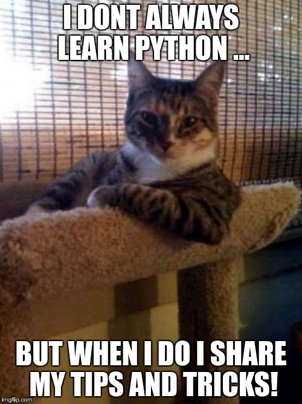

## 0x09. Python - Everything is object
In the previous section, we learned that everything in Python is an Object and every value has a type. Now let's explore how objects work

 python 

 object
- everything in python is an object, including the variables and data types
- objects are instances of classes
- a class defines how to create new objects (instances)
- you can define your own custom classes using the `class` keyword
- when we say "everything is an object" it means that even basic things like numbers and strings are actually objects
- all objects have certain attributes that they inherit from their parent class or other built-in classes
- methods: functions associated with an object
- `__init__`: special method used for initializing instance variables
- `__str__`: returns string representation of an object
- `__repr__`: returns printable representation of an object
- `__len__`: returns length of sequence type objects like list, tuple etc.
- `__getitem__`: allows access to elements by index position
- `__setitem__`: sets value at given index position
- `__delitem__`: deletes element at given index position
- `__iter__`: makes iterable object iterable
- `__next__`: generates next item in iteration
- `__contains__`: checks if a particular item exists within the object
- `__add__`, `__sub__`, `__mul__`, `__truediv__`, `__floordiv__`, `__mod__`,
`__pow__`, `__lshift__`, `__rshift__`, `__and__`, `__or__`, `__xor__`,
`__lt__`, `__gt__`, `__le__`, `__ge__`, `__eq__`, `__ne__`: these methods allow us to
perform arithmetic operations on objects
- `__call__`: allows calling an object as though it was a function
- `__getattr__`, `__setattr__`, `__delattr__`: get/set/delete attribute values
- `__dir__`: return set of valid attributes for this object
- `__hash__`: returns hash value of an object
- `__slots__`: restricts the number of named attributes an object has
- `__weakref__`: provides support for weak references
- `__doc__`: documentation string attached to the object
- `__dict__`: dictionary containing the object's attributes

